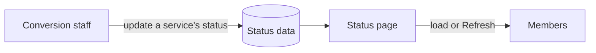

## Problem

When NextMark Credit Union joined Apple FCU, members' accounts, cards, online banking, and statements all moved to new systems. Each piece finished on its own schedule.

Members needed one place to see what was ready, what was still in progress, and what to do in the meantime.

## How it works

Staff updated each service as the conversion moved along. The backend that stored and served the data was handled by another team; I built the page members saw.

Members got the latest status by loading the page or pressing **Refresh**, and the **Last Update** time told them how current it was.

## Status model

Every service had one status, one plain-language description, and a resolution time.

| Status | Meaning |
| --- | --- |
| unavailable | not usable yet, with what to do in the meantime |
| in progress | being converted now |
| available | ready to use, with any setup steps |

Each status uses a different icon shape as well as a color, so it reads without relying on color alone.

## Decisions

- **One row per service.** Members care about their card or their bill pay, not the overall project. A table lets them find their thing and move on.
- **Plain-language descriptions.** Each row says what changed and what to do, like "use Forgot Password to complete setup."
- **Show when it was updated.** A visible Last Update time and a Refresh button answer "is this current?" without the page changing under someone mid-read.
- **Shape, color, and text together.** The legend and icons stay readable for color-blind members and on small screens.
- **Built to match the site.** Bootstrap kept the page responsive and consistent with the rest of applefcu.org.

## Outcome

Members had one place to check what was ready, before and after the February 1 switch.
