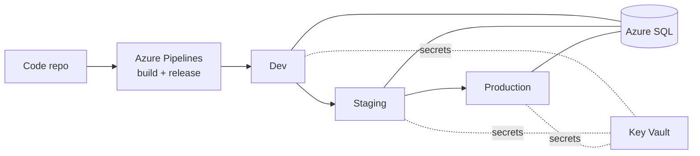

## Problem

The public website ran on servers the organization managed itself. Releases were done by hand, and there was no consistent path from development to production.

## Approach

The site moved to Azure App Service with its data in Azure SQL. Azure DevOps Pipelines builds each change and releases it through dev, staging, and production.

## My part

- Worked as a core developer on the team, doing hands-on migration work.
- Helped move the site and its data from on-prem hosting into App Service and Azure SQL.
- Worked on the pipelines that build and release the site.

## Outcome

- **Automated deploys.** Releases run through a pipeline instead of by hand.
- **Separate environments.** Dev, staging, and production are set up the same way, so a change is tested before it goes live.

## Kept private

Specific architecture, network setup, resource names, and security settings stay private. This page describes the shape of the work, not the configuration.
