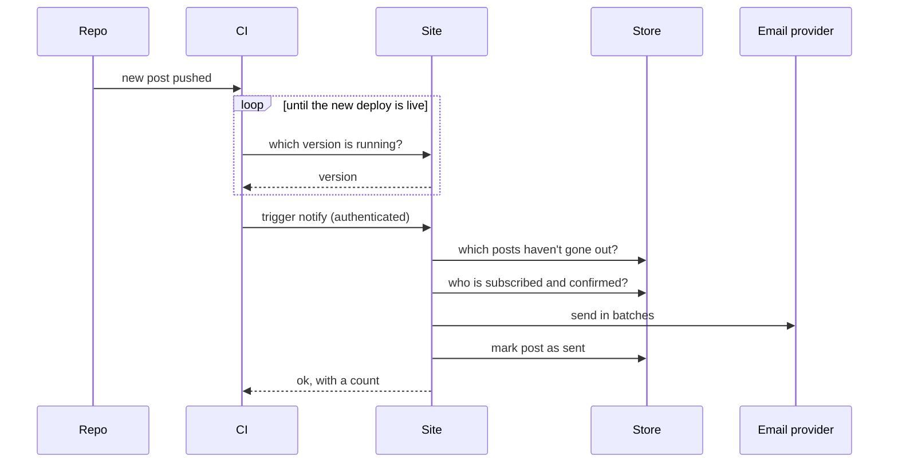

## Problem

CaringBridge emailed everyone following Francis's updates the moment we posted. When we moved to our own site, that feature didn't come with us.

I tried Buttondown first, but every email platform is built for running a mailing list: audiences, campaigns, open tracking. I needed one thing. When a new post goes up, tell the people who asked to know.

## Architecture



Subscribing is double opt-in. Unsubscribing is one click, no login.

## Behavior

Every signup goes through one decision before anything is written or sent.

| Someone signs up who is… | Result |
| --- | --- |
| new | create the subscriber, send a confirmation |
| waiting to confirm | resend the confirmation, at most once in a short window |
| already subscribed | do nothing, show the same success message |
| previously unsubscribed | reactivate with a fresh link |

The same idea runs the sender: given every post and the ones already sent, pick what's left. Drafts and future-dated posts are skipped, and the oldest goes first.

## Principles

- **Links in emails never change anything.** Email security scanners open links automatically. Opening a link only shows a page; a button press does the work.
- **Safe to run twice.** A post is recorded as sent, so re-running the job after a hiccup never emails anyone twice.
- **Check credentials first.** The notify trigger is rejected before it touches any data, using a comparison that takes the same time whether the secret is close or not.
- **Decisions are plain functions.** The logic takes data in and returns a decision, with no database or network calls inside, so every branch is tested without mocks.
- **Use what's already there.** The site already ran on Cloudflare, so storage and the API live there too instead of in a new service.

## Tests

```text
✓ new signup creates a subscriber and sends a confirmation
✓ resubmitting before confirming resends, then throttles
✓ an active subscriber signing up again changes nothing
✓ a returning subscriber is reactivated with a new link
✓ drafts and future-dated posts are never sent
✓ posts already sent are skipped
✓ recipients are split into batches the provider accepts
✓ secret comparison matches exact values only
```

## Config

The workflow only runs for blog changes, never runs twice at once, and can be started by hand.

```yaml
on:
  push:
    branches: [main]
    paths: ['src/content/blog/**']
  workflow_dispatch:

concurrency:
  group: notify-subscribers
  cancel-in-progress: false
```

## Lessons

- **Green isn't the same as working.** The job ran before the new post was live, found nothing to send, and reported success. Now it waits until the site is running the exact version that was pushed.
- **Your own platform can block you.** Two layers of protection rejected the automated trigger, and the script treated that as success. Every call now checks the actual response and fails loudly on anything unexpected.

```bash
code=$(curl -sS -o /dev/null -w '%{http_code}' -X POST "$NOTIFY_URL" \
  -H "Content-Type: application/json" \
  -H "<auth-header>: $SECRET")
[ "$code" = "200" ] || exit 1
```

## Tradeoffs

- Email batches are all-or-nothing: one bad address fails its whole batch.
- No retry queue. A failed send shows up in the workflow log and gets fixed by hand.
