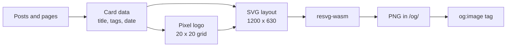

## Problem

Every page shared the same flat blue image when someone posted a link. Making a custom image per blog post meant opening a design tool every time, so it didn't happen.

I wanted each post and page to get its own preview automatically, matching the terminal look of the site.

## Output

## Pipeline

1. Gather card data for every page: the title, tags, date, and read time, the same data the on-page cards use.
2. Pick a logo. A post's `logo` field wins, otherwise the first tag with a Simple Icons match.
3. Lay out a 1200×630 SVG by hand. The font is monospace, so text width is just characters × 0.6em, and titles wrap at word breaks.
4. Render it to PNG with resvg compiled to WebAssembly, with the fonts bundled in.
5. Write the file and point the page's `og:image` tag at it.

## Pixel logos

Each logo starts as an SVG path. The curves are flattened into straight segments, a 20×20 grid goes over it, and each square is tested at 16 points. If about half land inside the shape, it's a pixel. The same pixel path draws the card on the page and the logo in the image, so they always match.

## Decisions

- **Build time, not request time.** Images are plain files Cloudflare serves like any asset. Nothing runs when someone shares a link.
- **WebAssembly over the native renderer.** The native build only runs in Node. The wasm build runs inside Cloudflare's build runtime, so the site stays on the default setup.
- **One source of truth.** The image uses the same card helper as the page, so a title change updates both.
- **Nothing extra shipped.** The renderer, fonts, and icon set are only used while building. The deployed worker is the same size as before.
- **Brand colors with a contrast check.** Logos use their brand color unless it's too dark on the black background, then switch to the light text color.

## Lessons

- **Block characters aren't reliable pixels.** The first logos used ▀ ▄ █ text. Fonts drew thin seams between them and fell back to other fonts on some devices, so the grid became an SVG path instead.
- **Preview images need full URLs.** Testing on a branch preview showed 404s because the tags pointed at the live domain, where the images didn't exist yet.
- **Layout math is easier in monospace.** No text measuring library. Every character is the same width, so wrapping and truncating is simple arithmetic.
